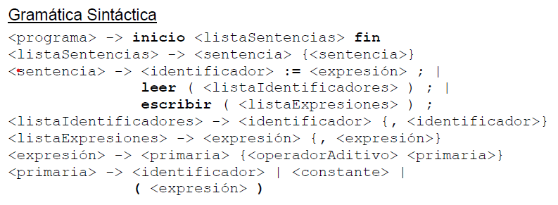

# Sintaxis y Semántica de los lenguajes: Trabajo Practico "Compilador lenguaje Micro ASDR"

- En este repositorio se puede encontrar un compilador del lenguaje micro programado en lenguaje c, el cual está basado en un autómata capaz de reconocer los tokens de la gramática léxica de micro y un parser ASDR construido a base de la gramática sintáctica de micro , las cuales están incluidas en este repositorio, además de algunas aclaraciones del lenguaje micro.

## Gramática léxica de micro

## Gramática Sintáctica de micro

## Descripcion del lenguaje micro

- El único tipo de dato es entero.
- Todos los identificadores son declarados implícitamente y con una
longitud máxima de 32 caracteres.
- Los identificadores deben comenzar con una letra y están compuestos
de letras y dígitos.
- Las constantes son secuencias de dígitos (números enteros).
- Hay dos tipos de sentencias, Asignación y Entrada/Salida
- Cada sentencia termina con un "punto y coma" (;). El cuerpo de un
programa está delimitado por inicio y fin
- inicio, fin, leer y escribir son palabras reservadas y deben
escribirse en minúscula.

## Información académica:

- Curso: K2055

- Año de cursada: 2023

- Modalidad : Anual

- Facultad: Universidad Tecnológica Nacional FRBA

## Información de lo integrantes

- Nombre:

- Rodríguez Lucas Ariel

- Golato Barcia Ivan Nahuel

- Sayago Pablo

- Rabahia Maron Leonel

- Schinca Mauro

- Numero de Grupo: 30